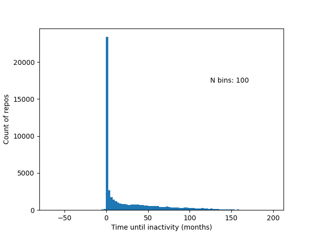
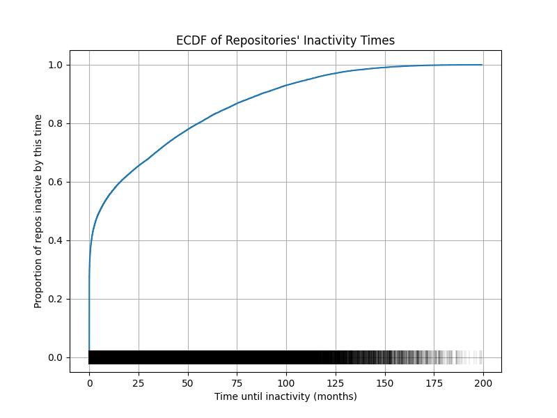
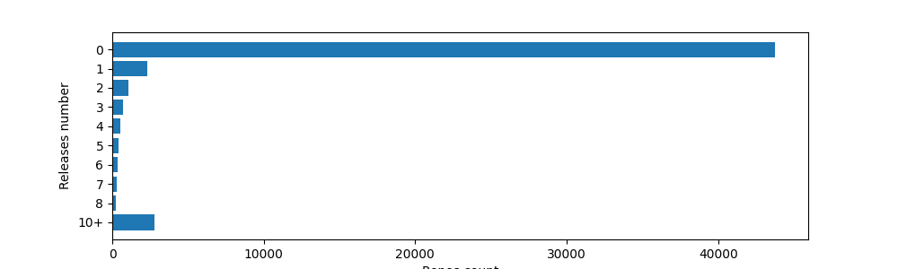
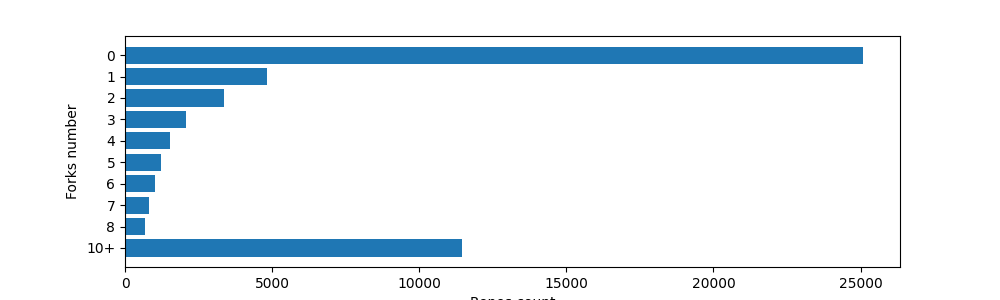
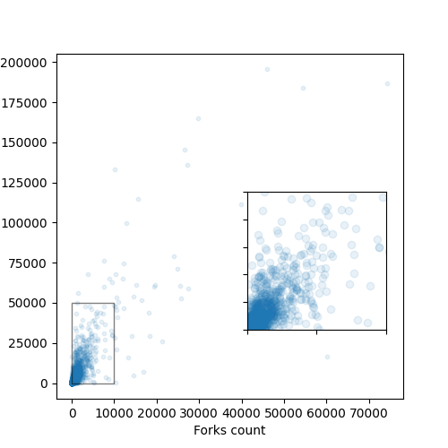
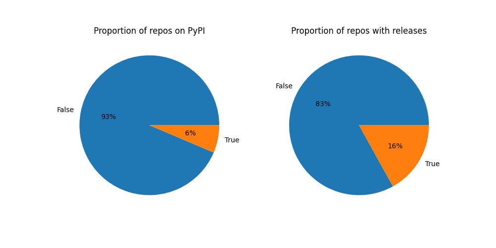

## Analysis of Research Software on GitHub
### Scope
We investigated the common usage of GitHub in the biomedical field. This work is inspired by the 
"Repository timelines on GitHub" analysis [[2]](#2)

### Dataset
We used the CZ Software Mention dataset [[1]](#1) as a starting point for this analysis.
We downloaded specifically the linked folder and analysed the "metadata.tsv" file, which contains the list of repos urls, 
mined from biomedical publications. From the metadata we selected the portion of the dataset that came from GitHub.

### Metrics

We downloaded generic metadata (e.g. license type, creation and update time), number of commits
on default branch (main, master), README and releases info from each of the available repos.

### Results

**Lifespan**

We analyzed the difference between the date of creation of the repo, and the date of the last update.
The majority of repos became inactive after a few months. Surprisingly we retrieved few repos with
"negative lifespans". These rare cases can arise when the repo was forked or cloned so that it inherited 
the commit history, and was never updated again. So the "last push" results before the creation of the new repo.

Computing the Empirical Cumulative Distribution Function (ECDF) underlines that about half of the repos
are inactive after 12 months.

**Commits** 

We split the commits data between below 95% percentile and above. This is to aid the visualization as the 
"above" repos (e.g. Linux) strongly skew the representation
The vast majority of repos only includes one single commit.

There is a weak correlation between the lifespan and the number of commits on default branch.

Analysing more in depth the distribution of commits across the year, we can highlight a trend leading to more and
more repos with very low numbers of commits, without a specific effect by the introduction of the FAIR
principles.

**README**

We classified the README in: none, short (<1500 bytes), detailed (between 1500 and 10000 bytes) 
and informative (>10000 bytes). And computed the proportion of each in the dataset.
An important metric in biomedical/research software is the connection between the bare software
and the original publication. To gain insights on this relation, we computed the proportion of 
repos that mention a DOI in the README
Finally, we displayed the word cloud of the most represented words in the headings.

**License**

Repositories can have an associated license, which details if and how the code can be used. We investigated
how many repos include a license, if at all, and what is the proportion of permissive licenses.

**Releases, Forks and Stars**

Package releases are stable version of package that are published on GitHub. We investigated how many, if at all, 
releases each repo has and whether this correlates with forks number, as a proxy for the repo
relevance. Interestingly we did not see a strong correlation between the number of releases and forks. We hypothesize 
that packages with high number of releases are stable software that the users tend to use "as is"
rather than modifying it. We then investigated the correlation between forks and stars, which can be used as 
a proxy for community interest and could observe a correlation.

### FAIR principles
We set to investigate general adherence to the FAIR principles, from the repos in the dataset. [[3]](#3)

**F**

A global, unique and persistent identifier is achieved, amon others, by either having a GitHub release or a 
published PyPI package (pip installable). To this end, we computed the percentage of (primarily Python) repos that 
feature in the PyPI dataset and the percentage of repos that have at least one release.

**A**

The software can always be downloaded from GitHub using https thus granting adherence to A1. 
However, the metadata is not necessarily independent from the software (A2).

**I**

The interoperability is highly dependednt on the filed the software is developed for, as it should "exchanges data in a 
way that meets domain-relevant community standards." [[3]](#3)

**R**

The sofware should be usable and reusable. To investigate this point, we computed the percentage of repos, with a 
permissive licence.

## References
<a id="1">[1]</a> Istrate, Ana-Maria; Veytsman, Boris; Li, Donghui et al. (2022). 
CZ Software Mentions: A large dataset of software mentions in the biomedical
literature [Dataset]. Dryad. https://doi.org/10.5061/dryad.6wwpzgn2c

<a id="2">[2]</a> RSE Repository Analysis
https://github.com/softwaresaved/rse-repo-analysis

<a id="3">[3]</a> FAIR principles
https://www.nature.com/articles/s41597-022-01710-x